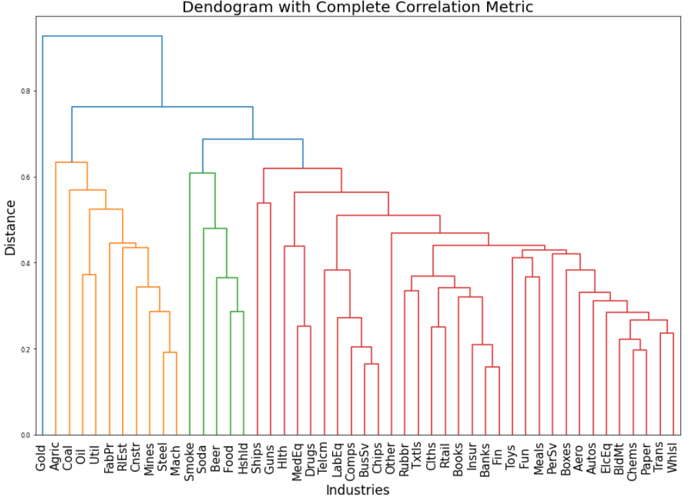
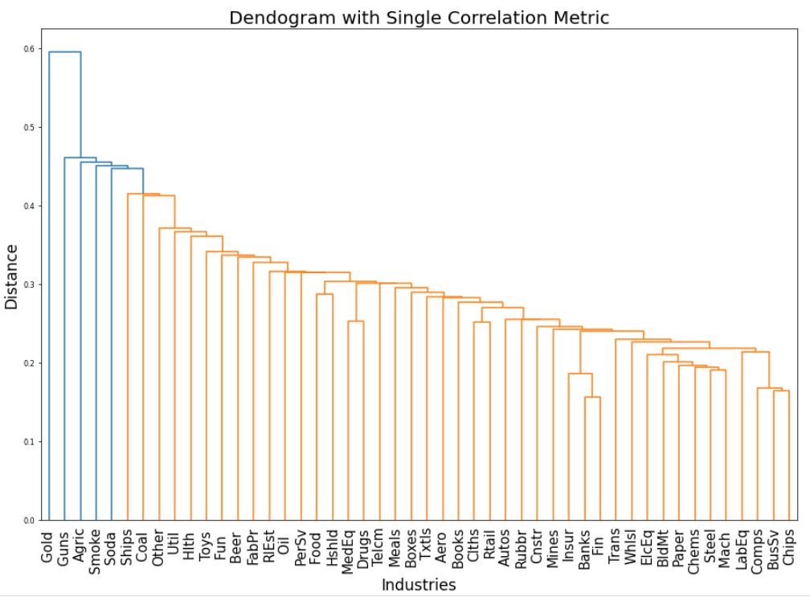
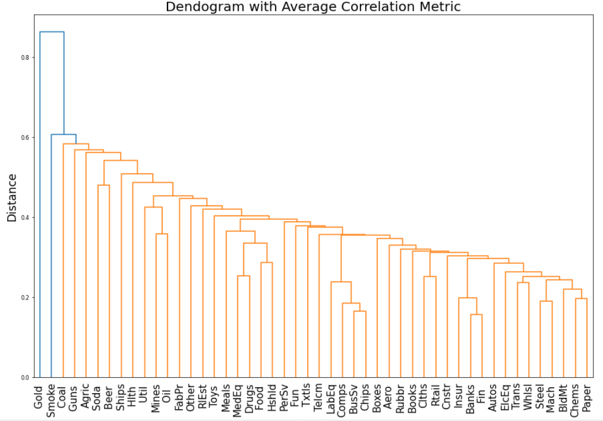
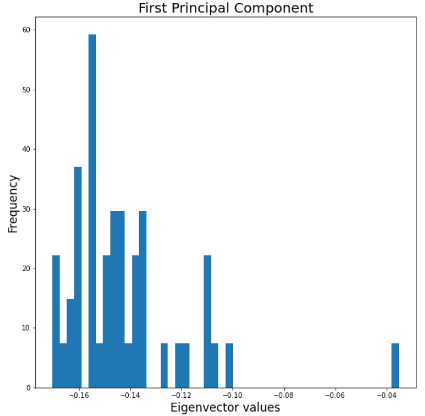
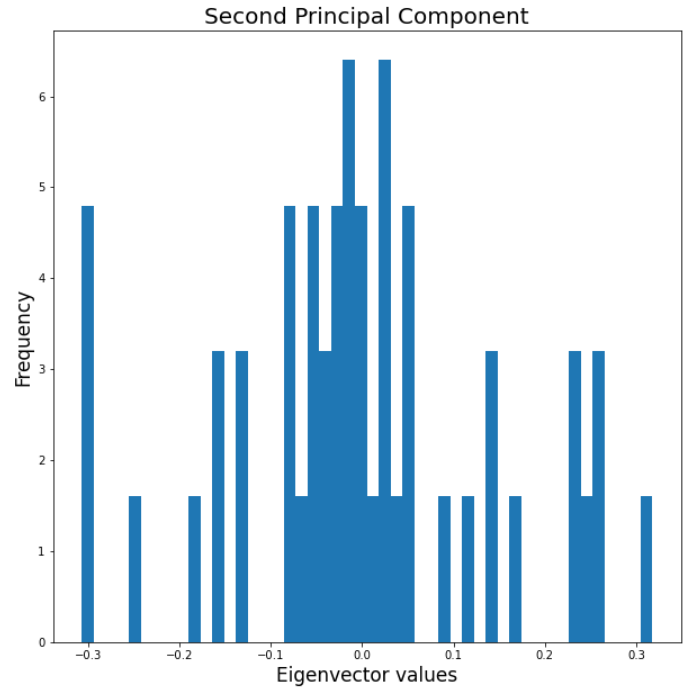
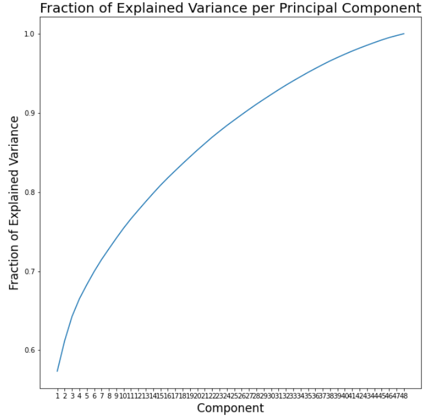

# Machine_Learning_for_Finance_2
COMP0050 Module - Assignment 2 @UCL  
✨ Hierarchical clustering for financial industries  
✨ Elbow diagrams  
✨ Principal Component Analysis and Explained Variance  

Some of the results produced in this analysis were the following:  
 

  
  
  
  
  
  
  

